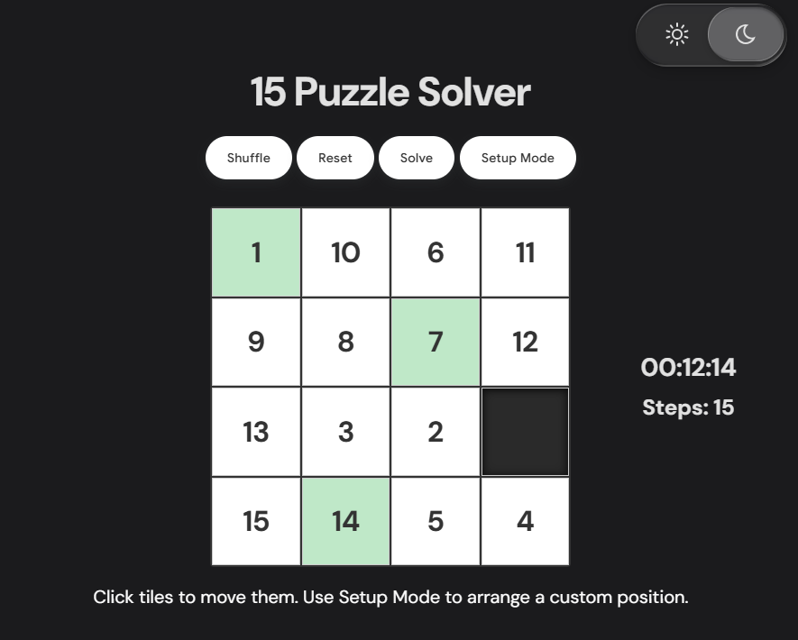

# 15 Puzzle Solver

A 15-puzzle that actually solves itself — reliably, quickly, and in close to the fewest moves possible.

I built this because I couldn't find one online that did all three at once. Most either freeze or time out on harder scrambles, take far more moves than necessary, or just don't look like something you'd want to sit and use. This one does none of that: shuffle, hit Solve, and it finds a near-optimal path in well under a second almost every time, with a slower but still-fast fallback for the rare pathological case.



## Try it

Just open `index.html` in a browser. It's plain HTML, CSS, and JavaScript.

## What it does

- **Click tiles or drag a solution through automatically** — manual play and auto-solve share the same board state, so you can mix the two freely (solve a few moves by hand, then let it finish, or interrupt an auto-solve mid-way to try something yourself).
- **Solves optimally in the vast majority of cases**, and always terminates quickly even on the rare board that would otherwise take a search too long to finish.
- **Setup Mode** lets you arrange any starting position by hand instead of only shuffling from solved.
- **Light, dark, and dim themes**, with a glassy, animated theme switcher ([by Vadim Matveev](https://codepen.io/fooontic/pen/KwpRaGr)).
- Tiles that are already in their correct spot get a quiet green tint, so you can see yourself converging on the solution as you go.
- A green flash sweeps the board the moment you solve it.
- Click a tile that can't legally move and it gives a quick shake instead of just sitting there unresponsive.

## How the solver works

The core is **IDA\*** (iterative-deepening A\*) over the classic single-tile-slide move model, using **Manhattan distance plus linear conflicts** as the heuristic — a standard, well-documented combination for the 15-puzzle, tuned with incremental heuristic updates so the heuristic doesn't have to be recomputed from scratch at every node of the search.

That standard combination is doing more work here than it might look like. An earlier version of this solver searched over a different move model — sliding an entire row or column at once, since that's what a single click actually does on this board. That felt like the natural way to model the actual UI action, but it broke something important: Manhattan distance is only an _admissible_ heuristic (one that never overestimates the true cost) when each move shifts exactly one tile. Once a single move can shift three or four tiles at once, one move can reduce the total Manhattan distance by more than one — which means the heuristic can now overestimate the moves actually needed, and IDA\*'s pruning guarantee quietly breaks. In practice this showed up as the solver occasionally exploring tens of millions of search nodes without finding anything, for boards that were only a few dozen moves from solved.

The fix was to decouple the two: search over single-tile slides internally, where the heuristic is provably valid and the branching factor is at most 4 instead of up to 6, then merge the resulting sequence of single-tile moves into the row/column slides the UI actually animates. Optimality and UI behavior stopped fighting each other once they were separated.

For the rare board where even a well-pruned IDA\* can't finish inside its time budget, there's a second search — weighted A\* with a bounded weight — that trades strict optimality for a hard guarantee of fast termination. It almost never triggers, but it means there's no scramble that can leave you waiting indefinitely.

Both searches run in a Web Worker, so the solving never blocks the page.

## Why plain HTML/CSS/JS

No framework, no build tooling, no `npm install` — clone it and open the file. For a board this size (a single 4×4 grid, a handful of buttons, one solver), a framework wouldn't be solving a real problem here, just adding a rendering layer between the code and the DOM. The interesting part of this project was never the UI plumbing.

## Project structure

```
index.html   — markup and the theme-switcher SVG filter
style.css    — layout, themes, animations
main.js      — game state, rendering, and the solver (runs in a Web Worker)
```

## License

This project's own code is MIT — see [LICENSE](LICENSE). The theme switcher
and the control button styling are adapted from other people's work and
remain under their original licenses; see
[THIRD_PARTY_NOTICES.md](THIRD_PARTY_NOTICES.md) for details and required
attributions.
